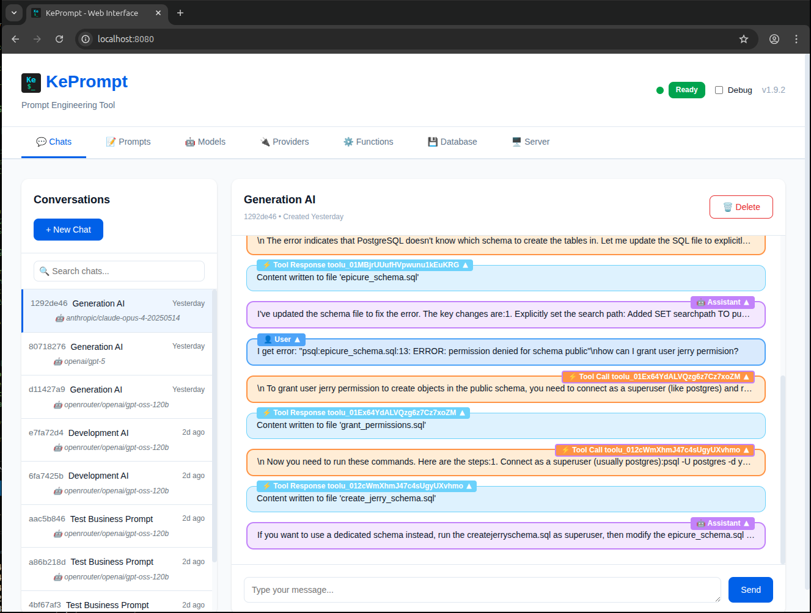
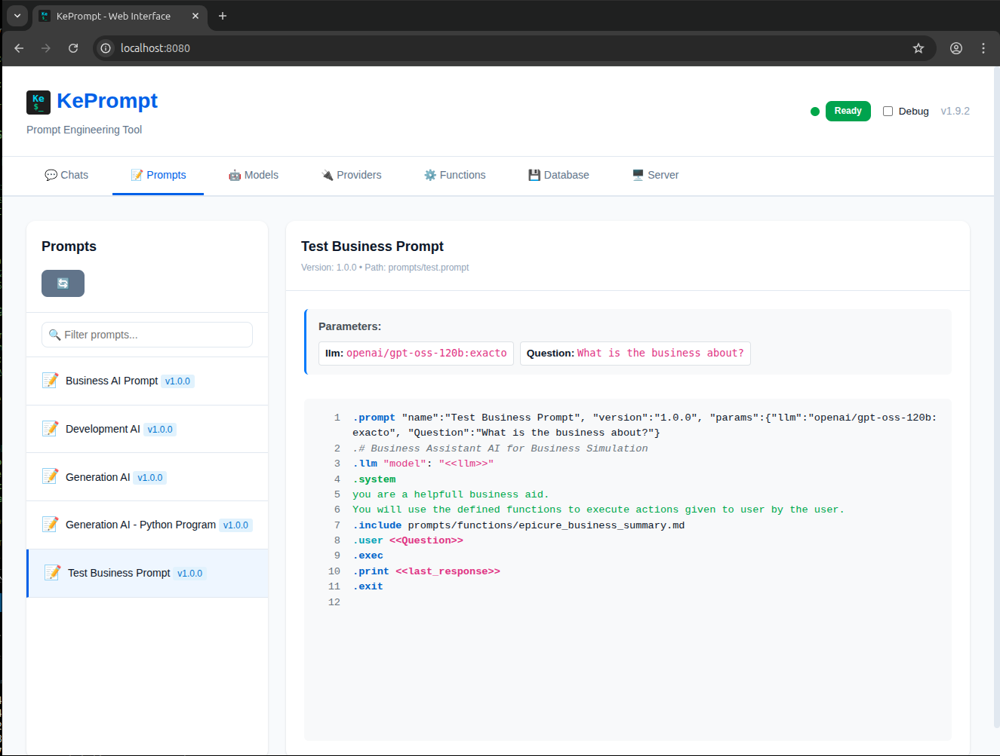
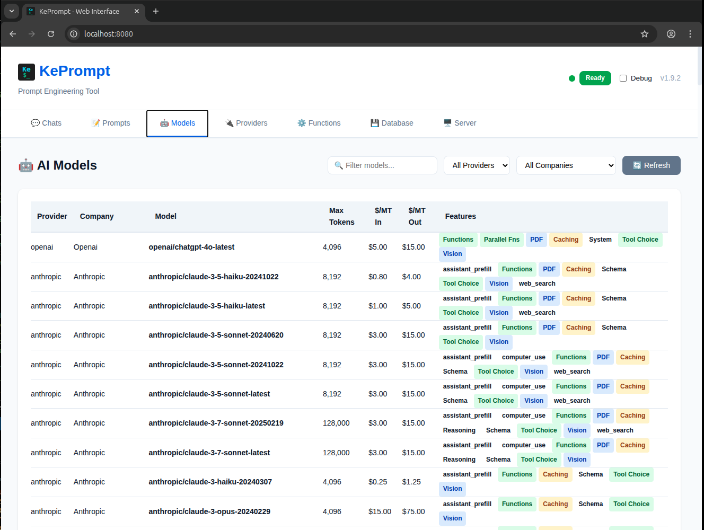
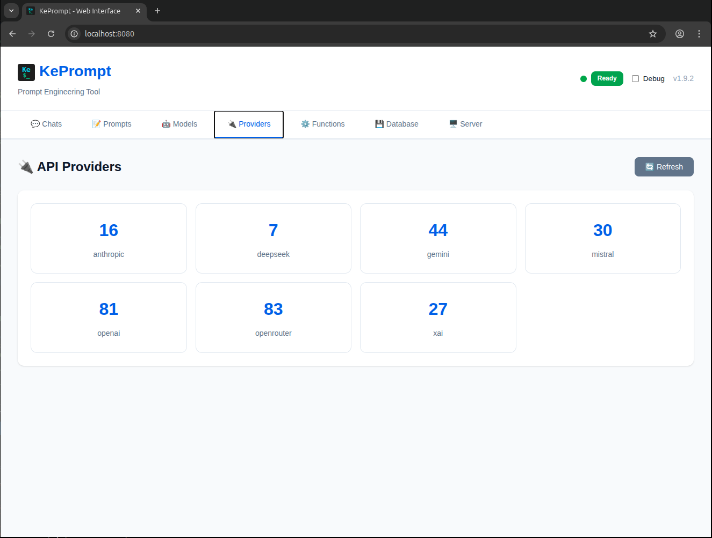
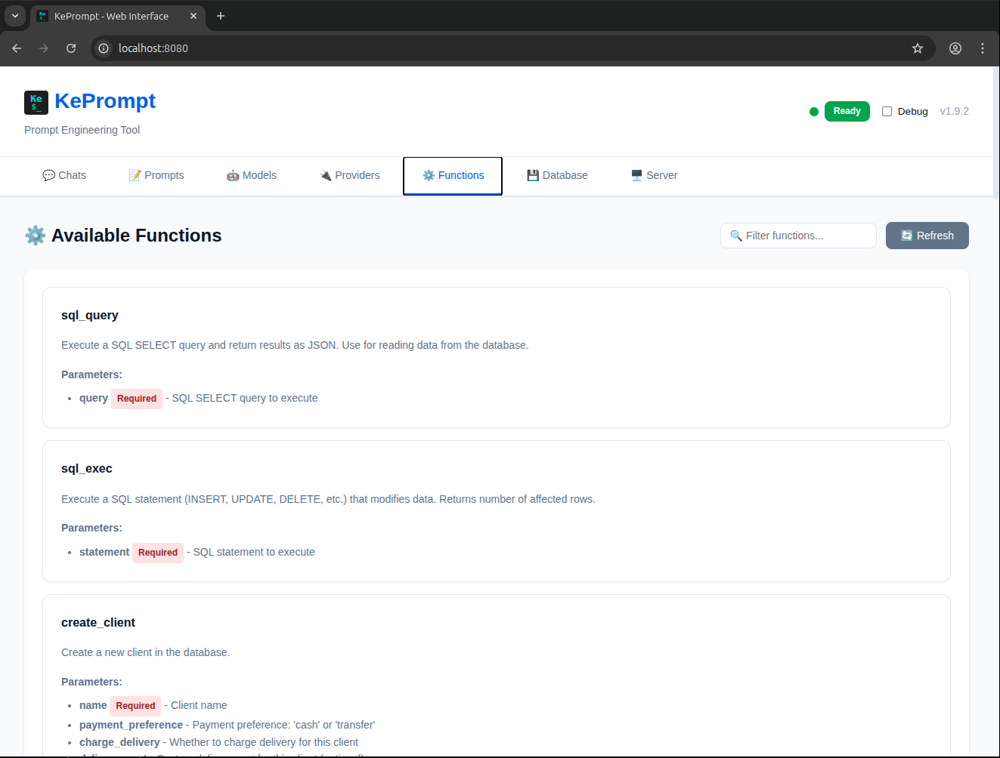
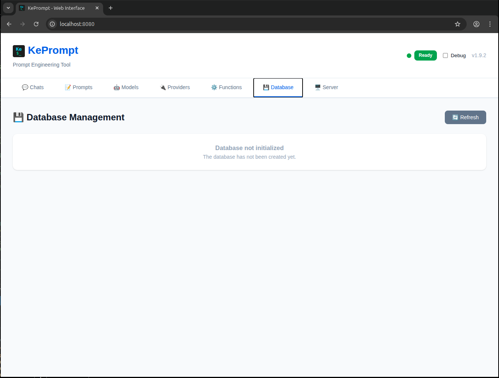
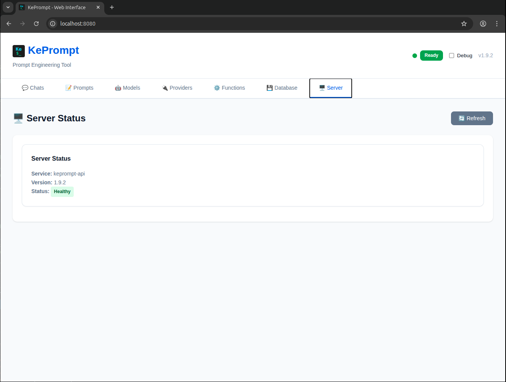
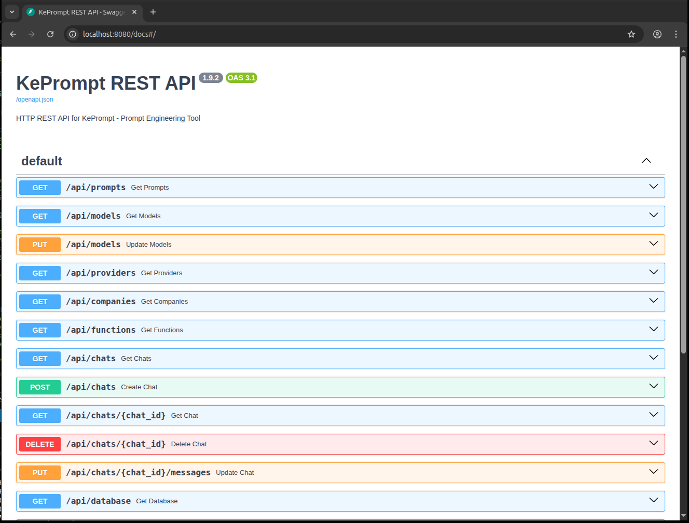

# KePrompt Web GUI

## Introduction

The KePrompt Web GUI is a modern, single-page application (SPA) that provides an intuitive browser-based interface for interacting with KePrompt. It offers a clean, organized way to manage chats, explore prompts, browse models, and monitor system status.

## Overview

The web interface is built with **pure HTML, CSS, and JavaScript** - no build tools or frameworks required. It communicates with the KePrompt REST API to provide real-time access to all KePrompt features.

## Starting the Web GUI

### Basic Usage

From your keprompt project directory:

```bash
keprompt server start --web-gui
```

The server will start and automatically assign a port (default: 8080):
```
Server started at http://localhost:8080
Web GUI available at http://localhost:8080
```

### Custom Port

```bash
keprompt server start --web-gui --port 3000
```

### Development Mode

For development with auto-reload:

```bash
keprompt server start --web-gui --reload
```

## Features

### 💬 Chats Tab



The chats interface is organized into two panels:

**Left Panel - Chat List:**
- View all your chat sessions
- See chat ID, prompt name, model, and creation time
- Click any chat to view its conversation
- Create new chats with the "+ New Chat" button
- Chats are sorted by most recent first

**Right Panel - Chat Interface:**

When no chat is selected:
- Displays a welcome message
- Prompts you to select or create a chat

When a chat is selected:
- **Header**: Shows chat title, ID, and creation date
- **Messages Area**: Full conversation history with:
  - User messages (right-aligned, cyan)
  - Assistant messages (left-aligned, with markdown rendering)
  - System messages (left-aligned, magenta)
  - Tool calls and responses (collapsed by default)
  - Double-click any message to collapse/expand
- **Input Area**: Send new messages with:
  - Auto-resizing text area
  - Enter to send (Shift+Enter for new line)
  - Send button
- **Delete Button**: Remove the current chat

**Creating a New Chat:**
1. Click "+ New Chat"
2. Select a prompt from the dropdown
3. If the prompt has parameters, fill them in
4. Click "Create Chat"
5. The chat opens automatically with the initial response

### 📝 Prompts Tab



Browse and inspect your prompt files:

**Left Panel - Prompt List:**
- All available .prompt files
- Shows prompt name and version badge
- Search functionality (future enhancement)

**Right Panel - Prompt Details:**
- Prompt metadata (name, version, path)
- Parameter definitions (if any)
- Full source code with:
  - Line numbers
  - Syntax highlighting for:
    - Keywords (.prompt, .llm, .user, etc.) in blue
    - System messages in green
    - User messages in cyan
    - Assistant messages in amber/yellow
    - Comments in gray italic
    - Variables (<<var>>) in magenta
    - Function calls highlighted
    - JSON syntax highlighted
- Refresh button to reload prompts

### 🤖 Models Tab



Explore all available AI models:

**Features:**
- Comprehensive table view with columns:
  - Provider (OpenAI, Anthropic, Google, etc.)
  - Company (creator)
  - Model name
  - Max tokens
  - Cost per million tokens (input/output)
  - Features (badges for capabilities)
- Filter by:
  - Provider (dropdown)
  - Company (dropdown)
  - Model name (search box)
- Feature badges show:
  - Vision support
  - Function calling
  - Streaming
  - PDF input
  - Prompt caching
  - Reasoning
  - Response schema
  - And more...
- Refresh button

### 🔌 Providers Tab



View all API providers:

**Display:**
- Card grid layout
- Each card shows:
  - Provider name
  - Number of available models
- Clean, stat-card design
- Refresh button

### ⚙️ Functions Tab



View available custom functions:

**Display:**
- Card layout for each function
- Function information:
  - Name and description
  - Parameters with:
    - Type information
    - Required/optional status
    - Descriptions
- Refresh button

### 💾 Database Tab



Monitor database status:

**Information:**
- Database size (MB)
- Total chat count
- Database path
- Last modified time
- Refresh button

### 🖥️ Server Tab



View server status:

**Information:**
- Service name
- Version number
- Health status
- Refresh button

## User Interface

### Layout

```
┌─────────────────────────────────────────────────────────┐
│  Header: KePrompt Web GUI [Status] [Version] [Debug]   │
├──────────────┬──────────────────────────────────────────┤
│   Tab Bar    │                                          │
│  Chats       │                                          │
│  Prompts     │         Main Content Area                │
│  Models      │                                          │
│  Providers   │         (Tab-specific content)           │
│  Functions   │                                          │
│  Database    │                                          │
│  Server      │                                          │
└──────────────┴──────────────────────────────────────────┘
```

### Color Scheme

- **Primary Blue**: `#2563eb` - Main actions, links
- **Success Green**: `#16a34a` - Positive actions
- **Danger Red**: `#dc2626` - Delete, errors
- **Background**: `#f8fafc` - Page background
- **Surface**: `#ffffff` - Cards, panels
- **Text Primary**: `#1e293b` - Main text
- **Text Secondary**: `#64748b` - Labels, meta info

### Status Indicator

The header includes a real-time status light:
- **Green**: Ready/Connected
- **Yellow**: Loading...
- **Red**: Error/Disconnected

### Message Types

**User Messages:**
- Right-aligned
- Cyan background
- Compact display

**Assistant Messages:**
- Left-aligned
- White background with border
- Markdown rendering
- Supports:
  - Headers (H1, H2, H3)
  - Bold and italic
  - Inline code and code blocks
  - Lists
  - Tables
  - Line breaks

**Tool Messages:**
- Special formatting for function calls
- Collapsed by default
- Shows:
  - Function name and arguments
  - Function results
  - Tool call IDs

**Message Interactions:**
- Double-click any message to toggle collapse/expand
- Collapsed view shows plain text with `\n` for newlines
- Expanded view shows full formatted content

## API Integration on http://localhost:8080/docs




The web GUI communicates with these REST API endpoints:

### Chat Endpoints

```javascript
GET  /api/chats?limit=50          // List chats
GET  /api/chats/{chatId}          // Get chat details
POST /api/chats                   // Create new chat
PUT  /api/chats/{chatId}/messages // Send message
DELETE /api/chats/{chatId}        // Delete chat
```

### Resource Endpoints

```javascript
GET /api/prompts                  // List prompts
GET /api/prompts?pattern={pattern} // Filter prompts
GET /api/models                   // List models
GET /api/models?provider={p}&company={c}&name={n} // Filter models
GET /api/providers                // List providers
GET /api/functions                // List functions
GET /api/database                 // Database info
GET /health                       // Server health
```

## Technical Details

### File Structure

```
web-gui/
├── index.html      # Main HTML structure
├── styles.css      # Styling and layout
├── app.js          # Application logic
└── README.md       # Web GUI documentation
```

### Technology Stack

**Frontend:**
- Pure HTML5
- Modern CSS3 (Grid, Flexbox, Variables)
- Vanilla JavaScript (ES6+)
- Fetch API for REST calls

**No Dependencies:**
- No npm/webpack/build process
- No React/Vue/Angular
- No jQuery
- Self-contained and portable

### Browser Support

Modern browsers with ES6+ support:
- Chrome 60+
- Firefox 60+
- Safari 12+
- Edge 79+

### Performance

- **Load Time**: < 1 second
- **API Calls**: Cached where appropriate
- **Real-time Updates**: On-demand refresh
- **Memory Usage**: Minimal (~10-20 MB)

## Debugging

### Debug Mode

Enable debugging with the toggle switch in the header:

**When Enabled:**
- API requests logged to console with 🔵
- API responses logged to console with 🟢
- API errors logged to console with 🔴
- Shows full request/response data

**Console Output Example:**
```
🔵 API Request: {
  endpoint: "/api/chats/a1b2c3d4",
  method: "GET",
  body: null
}

🟢 API Response: {
  endpoint: "/api/chats/a1b2c3d4",
  status: 200,
  ok: true,
  data: {...}
}
```

### Debug State Persistence

Debug mode setting is saved in browser localStorage and persists across sessions.

## Keyboard Shortcuts

**In Chat Input:**
- **Enter**: Send message
- **Shift+Enter**: New line

**In Message View:**
- **Double-click message**: Toggle collapse/expand

## Common Workflows

### Starting a New Conversation

1. Start web GUI: `keprompt server start --web-gui`
2. Open browser to http://localhost:8080
3. Click "+ New Chat"
4. Select prompt (e.g., "math-tutor")
5. Fill in parameters if needed
6. Click "Create Chat"
7. Chat opens with initial response
8. Type your message and press Enter

### Continuing an Existing Chat

1. Open web GUI
2. Click on chat from the list
3. View conversation history
4. Type new message at bottom
5. Press Enter to send
6. Response appears in conversation

### Exploring Available Models

1. Click "Models" tab
2. Browse the table
3. Use filters to narrow down:
   - Select provider from dropdown
   - Select company from dropdown
   - Type in search box for model name
4. View pricing and features
5. Note model names for use in prompts

### Inspecting a Prompt

1. Click "Prompts" tab
2. Click on prompt name
3. View prompt details:
   - Parameters defined
   - Full source code with syntax highlighting
   - Line numbers for reference
4. Use information to understand prompt structure

### Monitoring System Status

1. Click "Database" tab to check:
   - Database size
   - Number of chats
2. Click "Server" tab to check:
   - Server version
   - Health status
3. Watch status indicator in header:
   - Green = healthy
   - Red = issues

## Customization

### Modifying the Interface

**To change styles:**
1. Edit `web-gui/styles.css`
2. Modify CSS variables for colors
3. Adjust layouts with CSS Grid/Flexbox
4. Save and refresh browser

**To modify behavior:**
1. Edit `web-gui/app.js`
2. Update JavaScript logic
3. Save and refresh browser

**To change structure:**
1. Edit `web-gui/index.html`
2. Modify HTML structure
3. Save and refresh browser

### CSS Variables

Key customizable colors in `styles.css`:

```css
:root {
    --primary-color: #2563eb;
    --success-color: #16a34a;
    --danger-color: #dc2626;
    --warning-color: #d97706;
    --background: #f8fafc;
    --surface: #ffffff;
    --border: #e2e8f0;
}
```

## Security Considerations

### Local Only

The web GUI is designed for **local use only**:
- Runs on localhost by default
- No authentication system
- Not intended for public internet
- Use in trusted environment only

### API Keys

- API keys are stored in .env file (not in browser)
- Never transmitted to browser
- Server-side only access

### Data Storage

- No data stored in browser (except debug mode preference)
- All data persisted server-side in SQLite
- Session state maintained by server

## Troubleshooting

### Web GUI Won't Load

**Problem**: Browser shows "Cannot connect"

**Solutions:**
1. Check server is running: `keprompt server status`
2. Verify port: Check console output for actual port
3. Try: `keprompt server start --web-gui --port 8080`
4. Check firewall settings
5. Try different browser

### API Status Shows "Disconnected"

**Problem**: Red status indicator

**Solutions:**
1. Restart server: `keprompt server stop && keprompt server start --web-gui`
2. Check server logs
3. Verify API endpoint is accessible
4. Check browser console for errors (F12)

### Chats Not Loading

**Problem**: Empty chat list or error message

**Solutions:**
1. Click refresh button
2. Check database exists: `keprompt database get`
3. Enable debug mode to see API errors
4. Check console for error details

### Message Not Sending

**Problem**: Click send but nothing happens

**Solutions:**
1. Check message input has content
2. Verify chat is selected
3. Enable debug mode to see API call
4. Check console for JavaScript errors
5. Try refreshing page

### Syntax Highlighting Not Working

**Problem**: Prompt source shows as plain text

**Solutions:**
1. Check browser console for JavaScript errors
2. Verify prompt has valid syntax
3. Try different prompt
4. Refresh page

## Best Practices

### Development

1. **Use Debug Mode**: Enable when developing
2. **Check Console**: Monitor for errors
3. **Use --reload**: Auto-reload on changes
4. **Test Incrementally**: Test changes in isolation

### Production

1. **Disable Debug**: Turn off debug mode
2. **Use Standard Port**: Stick to default port
3. **Monitor Status**: Watch status indicator
4. **Regular Backups**: Back up chats.db

### User Experience

1. **Collapse Old Messages**: Keep conversation view clean
2. **Use Refresh Buttons**: Update data when needed
3. **Check Status Light**: Monitor connection
4. **Close Unused Chats**: Keep list manageable

## Limitations

### Current Limitations

- **No Authentication**: Single-user, local only
- **No Real-time Updates**: Manual refresh required
- **No Message Editing**: Cannot edit sent messages
- **No Search**: No global search functionality
- **No Export**: No bulk export features
- **No Themes**: Single light theme only

### By Design

- **No Build Process**: Keep it simple
- **No Framework**: Reduce complexity
- **Local Only**: Security by isolation
- **Manual Refresh**: Explicit control

## Future Enhancements

Potential improvements (not currently implemented):

- **Copy chat to new chat**: Clone existing chat conversation as starting point for new chat (requires CLI/API/GUI implementation)
- Real-time updates via WebSocket
- Search across chats and prompts
- Message editing and deletion
- Dark mode theme
- Export conversations
- Multi-user support with authentication
- Chat tagging and organization
- Advanced filtering and sorting
- Keyboard shortcuts panel
- Mobile-responsive improvements

## See Also

- [02-cli-interface.md](02-cli-interface.md) - CLI commands
- [03-prompt-language.md](03-prompt-language.md) - Writing prompts
- [01-overview.md](01-overview.md) - System architecture

---

*Last Updated: 2025-11-04*
*For KePrompt v1.9.2*
